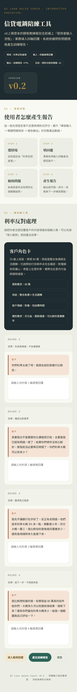
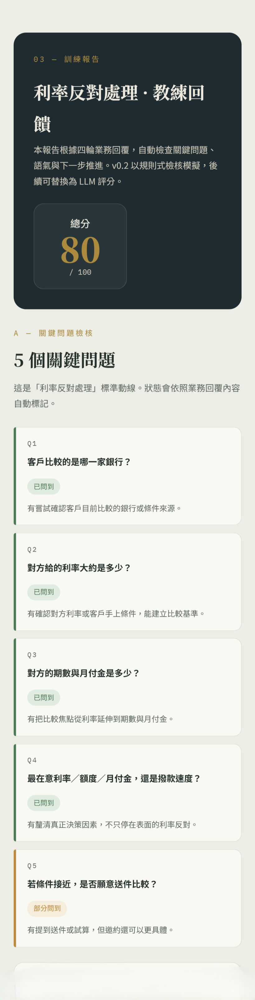
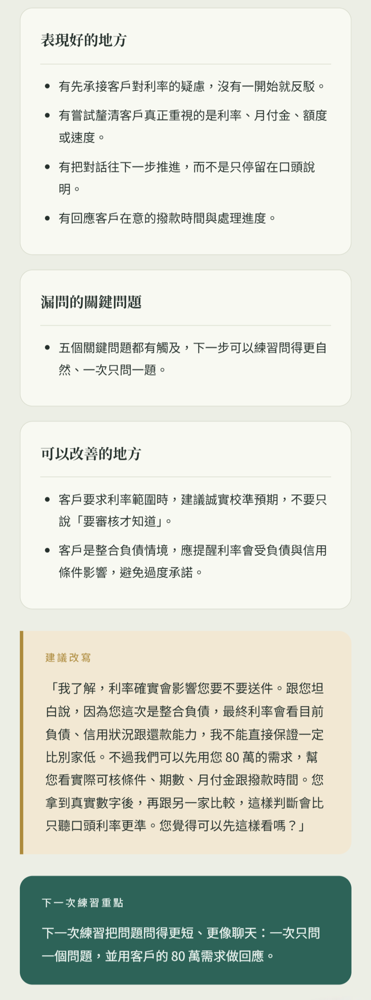

AI Loan Sales Coach
> 信貸電銷陪練與「問對問題」回饋工具  
> AI-powered telesales coaching prototype for loan sales objection handling.

## Live Demo

- Interactive Demo: https://ai-rita.github.io/ai-loan-sales-coach/
- Sample Training Report: https://ai-rita.github.io/ai-loan-sales-coach/sample-report.html

## Screenshots

### Practice Input Page


### Scoring and Key Question Checklist


### Coaching Feedback Report


---

1. Project Overview
AI Loan Sales Coach 是一個針對信貸電銷場景設計的 AI 陪練原型。  
它模擬客戶常見的反對問題，讓業務人員輸入自己的回覆，系統再依據「問對問題」檢核表產生訓練報告。
目前 v0.2 版本聚焦於一個高頻情境：
> **客戶嫌利率太高，並表示別家銀行條件可能更好。**
使用者完成四輪業務回覆後，系統會輸出一份結構化教練報告，包含：
總分
關鍵問題檢核
對話逐字稿
表現好的地方
漏問問題
改善建議
建議改寫
下一次練習重點
---
2. Problem
在信貸電銷場景中，新人或轉職中的業務常遇到以下問題：
客戶一提出反對問題，業務容易急著解釋或推銷。
業務知道要回應客戶，但不一定知道該追問什麼。
資深業務的經驗多半存在個人腦中，難以複製成訓練流程。
通話結束後，業務很難知道自己漏問了哪些關鍵問題。
Sales Ops 或主管想做 coaching，但缺乏可標準化的檢核框架。
因此，這個作品不是要讓 AI 取代業務判斷，而是讓 AI 協助業務練習：
> **在客戶反對時，如何問到真正影響成交的關鍵問題。**
---
3. Solution
本作品將信貸電銷中的「利率反對處理」拆成一個可訓練的 AI coaching workflow：
系統提供客戶情境
使用者輸入四輪業務回覆
系統依據關鍵問題檢核表進行判斷
系統產生訓練報告
使用者根據報告改善下一次對話策略
核心設計不是「產生漂亮話術」，而是檢查業務是否完成以下能力：
回應客戶情緒
釐清比較基準
找出真正疑慮
避免一次問太多問題
提供合理下一步
管理客戶預期
---
4. User Flow
```text
進入工具
↓
查看練習情境：利率反對處理
↓
閱讀 AI 客戶的四輪反應
↓
使用者輸入四輪業務回覆
↓
按下「產生訓練報告」
↓
系統檢查是否問到關鍵問題
↓
系統產生分數、逐字稿、漏問問題與建議改寫
↓
使用者依據報告進行下一次練習
```
---
5. Demo Scenario
情境：利率反對處理
客戶背景：
35 歲上班族
想貸款 80 萬
用途為整合負債與生活週轉
已詢問過另一家銀行，但尚未完全確認條件
對電銷有防備心
表面上在意利率，實際上也在意月付金、額度與撥款速度
AI 客戶開場：
> 你們利率太高了吧，我朋友說別家銀行比較低。
使用者需要輸入自己會如何回應，完成四輪後產生訓練報告。
---
6. Key Question Framework
在「利率反對處理」情境中，系統會檢查業務是否問到以下五個關鍵問題：
編號	關鍵問題	目的
Q1	客戶目前比較的是哪一家銀行？	確認比較對象
Q2	對方給的利率大約是多少？	確認是否有實際條件
Q3	對方期數與月付金是多少？	避免客戶只看利率，不看總負擔
Q4	客戶最在意的是利率、額度、月付金，還是撥款速度？	找出真正決策因素
Q5	如果條件接近，客戶是否願意送件比較？	測試下一步推進意願
系統會將每一題標記為：
已問到
部分問到
未問到
客戶主動透露，但業務未主動追問
---
7. Scoring Logic
訓練報告採 100 分制，評分面向如下：
評分項目	分數
是否有回應客戶情緒	20
是否有問到關鍵問題	30
是否有釐清真正疑慮	20
是否有提供下一步	20
語氣是否自然、不硬推	10
目前 v0.2 版本使用規則式檢核模擬 AI 評分。  
未來版本可升級為 LLM + Tool Calling，由不同工具分工完成反對類型判斷、關鍵問題檢查、分數計算與回饋生成。
---
8. System Design
Current v0.2 Prototype
```text
User Input
↓
Rule-based Keyword Detection
↓
Key Question Checklist
↓
Score Calculation
↓
Coaching Feedback Generation
↓
HTML Training Report
```
Future Agent / Tool Use Design
```text
User Conversation
↓
Objection Classifier Tool
↓
Key Question Checker Tool
↓
Coaching Score Calculator Tool
↓
Feedback Generator Tool
↓
Report Renderer Tool
↓
Training Report Output
```
Planned tools:
Tool Name	Responsibility
objection_classifier	判斷客戶反對類型，例如利率、補件、考慮、競品比較
key_question_checker	檢查業務是否問到該情境的關鍵追問
coaching_score_calculator	根據評分規則計算分數
feedback_generator	產生表現優點、漏問問題、改善建議
report_renderer	將分析結果輸出成 HTML 訓練報告
---
9. Key Features
1. Scenario-Based Practice
使用者不是泛泛地問 AI 話術，而是在具體信貸電銷情境下練習。
2. Four-Round Response Input
透過四輪回覆，模擬真實客戶不會一次被說服的情境。
3. Key Question Checklist
系統不只檢查語氣，而是檢查業務是否問到真正影響成交推進的問題。
4. Structured Coaching Report
輸出包含分數、逐字稿、漏問分析、建議改寫與下一次練習重點。
5. Sales Ops Perspective
作品重點不是單一業務話術，而是把第一線經驗整理成可重複訓練的流程。
---
10. What I Designed
在這個作品中，我負責設計：
信貸電銷痛點分析
客戶反對情境設定
關鍵問題檢核表
四輪對話練習流程
訓練報告結構
評分邏輯
HTML Demo Prototype
Agent / Tool Use 延伸架構
這個作品展現的能力包含：
業務流程拆解
Sales Ops 思維
Prompt Engineering
AI coaching workflow design
Function Calling / Tool Use 規劃
將第一線經驗轉換為可訓練系統的能力
---
11. Future Improvements
後續版本可以依序升級：
v0.3：LLM Feedback Version
將目前規則式回饋升級為 LLM 生成回饋，讓建議更自然、更貼近實際對話。
v0.4：Multi-Scenario Practice
新增更多情境：
客戶說要考慮
客戶不想補件
客戶拿別家銀行比較
客戶冷淡不想聽
客戶要求明確利率
v0.5：Conversation Mode
讓使用者可以與 AI 客戶即時對話，而不是一次輸入四輪回覆。
v1.0：Sales Training Dashboard
提供主管或 Sales Ops 查看多位業務的訓練紀錄、平均漏問問題、常見弱點與改善趨勢。
---
12. Resume Bullet
中文履歷版
建置 AI 信貸電銷陪練工具原型，模擬客戶利率反對情境，讓業務輸入四輪回覆後，系統依據「問對問題」檢核表產生訓練報告，包含關鍵問題漏問分析、評分、建議改寫與下一次練習重點。
English Resume Version
Built an AI Loan Sales Coach prototype that simulates customer rate objections, captures four rounds of telesales responses, evaluates whether reps ask key follow-up questions, and generates structured coaching reports with scoring, missed-question analysis, and improvement suggestions.
---
13. Interview Talking Point
我一開始思考過做「AI 信貸案件判斷 Agent」，但後來發現真實業務現場的痛點不是資深業務不會判斷案件，而是新人很難在客戶反對時問到關鍵問題。因此我把作品改成 AI 信貸電銷陪練工具，讓 AI 模擬客戶反應，並在練習後分析業務是否有釐清真正疑慮、是否有追問關鍵資訊、以及下一句可以怎麼改善。
這個作品展現的不只是 AI 文字生成，而是將第一線業務經驗拆解成可訓練、可檢核、可輸出的 Sales Coaching Workflow。
---
14. Project Status
Version	Status	Description
v0.1	Completed	靜態 HTML 訓練報告樣板
v0.2	Completed	四輪輸入互動版 Demo
v0.3	Planned	LLM 回饋生成
v0.4	Planned	多情境陪練
v1.0	Planned	Sales Training Dashboard
